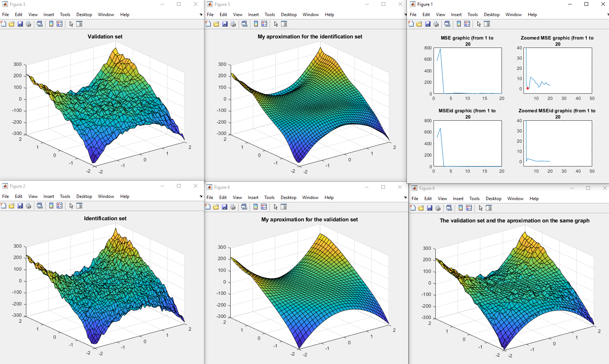
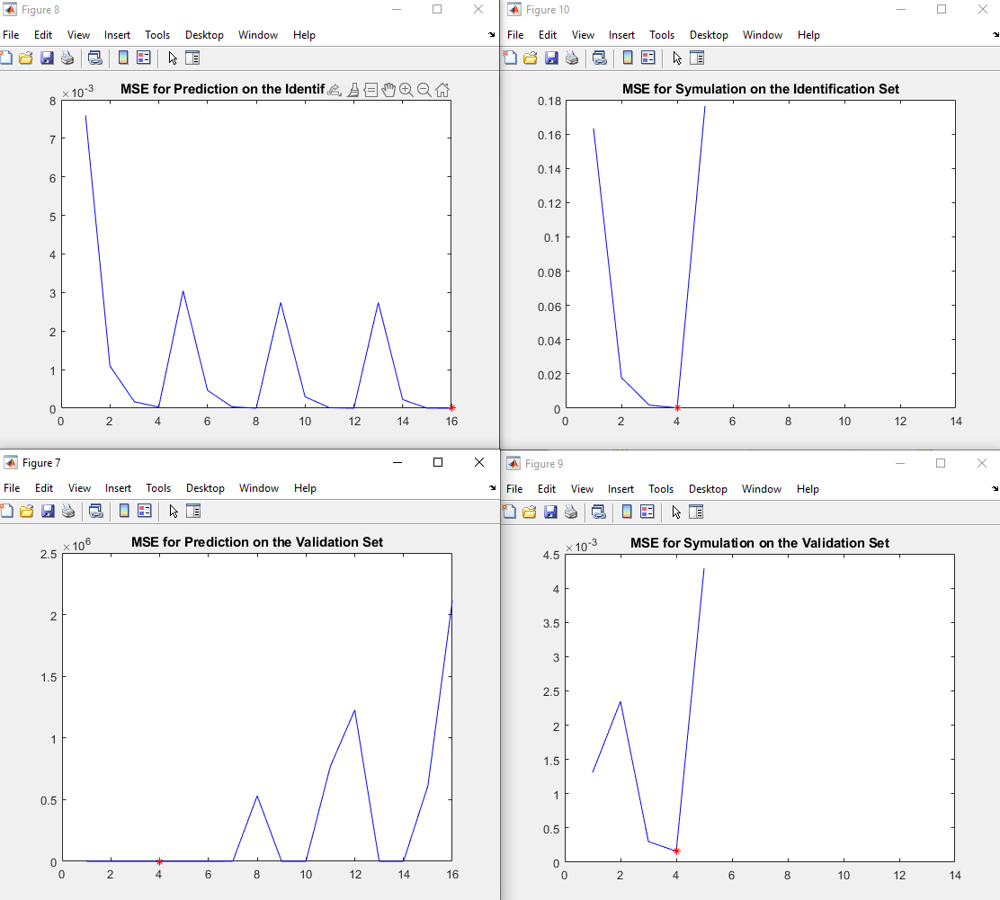
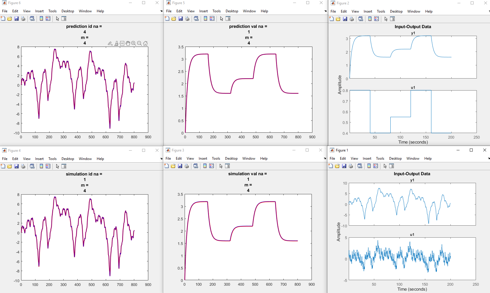

# System_Identification_Project

## Fitting an unknown function
## Overview 

The task involves developing a polynomial approximator for a nonlinear static function f, given a dataset of input-output pairs corrupted by additive zero-mean Gaussian noise. The function has two input variables and one output variable. The training and validation datasets are provided as MATLAB data files, each containing a structure with grid coordinates for inputs and corresponding outputs. The polynomial approximator g is of configurable degree m, and the task is to find the optimal parameter vector θ such that g(x) best matches f(x) in a least-squares sense. Linear regression is used to find θ, considering that g is linear in the parameters.

## Preview

#### The Plots


## Getting Started

### Prerequisites
- [Matlab](https://matlab.mathworks.com/)

### Installing
1. Clone the repository:
   ```bash
   git clone https://github.com/RadAntonio/System_Identification_Project.git
   ```
2. Open the file
    ```bash
   Fitting_An_Unknown_Function.m
   ```
3. Make sure you have the data file in the same folder as the .m file
    ```bash
   proj_fit_19
   ```
4. Run the project

## Nonlinear ARX Identification
## Overview 

The task involves developing a black-box model for an unknown dynamic system with one input and one output. The system's dynamics are nonlinear, and the order of the dynamics is not larger than three. The output may also be affected by noise. A polynomial nonlinear ARX model is chosen for modeling, where the input-output relationship is represented by a polynomial function of delayed inputs and outputs.

## Preview

#### Mean Squared Error Plots

#### Prediction and simulation with the smallest MSE for both identification and simulation dataset


## Getting Started

### Prerequisites
- [Matlab](https://matlab.mathworks.com/)

### Installing
1. Clone the repository:
   ```bash
   git clone https://github.com/RadAntonio/System_Identification_Project.git
   ```
2. Open the file
    ```bash
   NonLinear_ARX_Identidication.m
   ```
3. Make sure you have the data file in the same folder as the .m file
    ```bash
   iddata-08
   ```
4. Run the project


## Contributing
Contributions are welcome and greatly appreciated. If you have suggestions for improving this application, please fork the repo and create a pull request or open an issue.

1. Fork the Project
2. Create your Feature Branch (`git checkout -b feature/AmazingFeature`)
3. Commit your Changes (`git commit -m 'Add some AmazingFeature'`)
4. Push to the Branch (`git push origin feature/AmazingFeature`)
5. Open a Pull Request

## License
This project is licensed under the MIT License - see the [LICENSE](LICENSE) file for details.
    